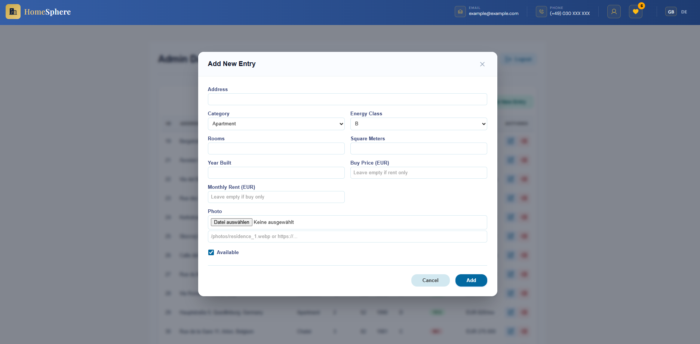
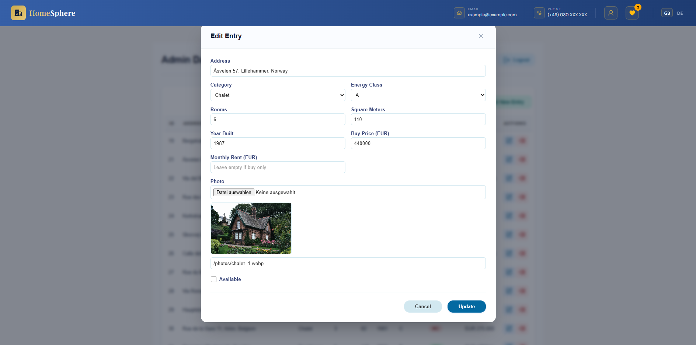
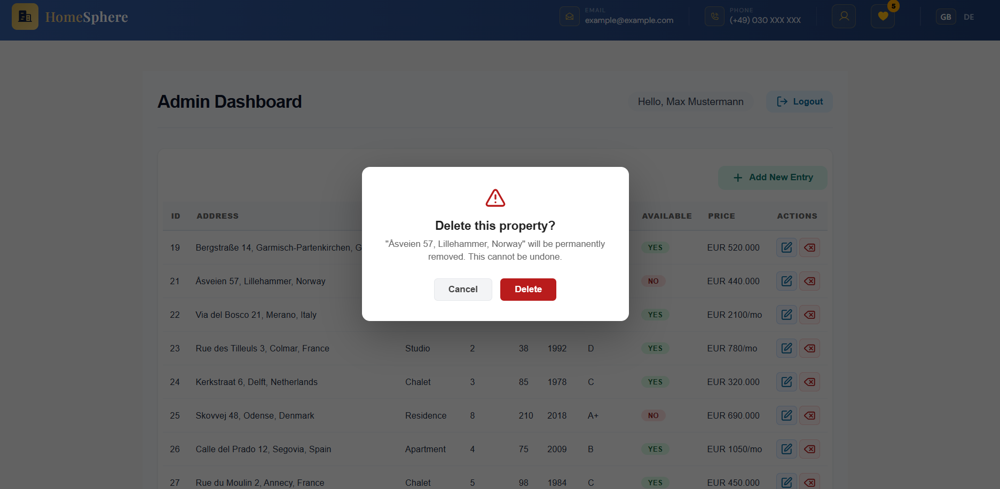
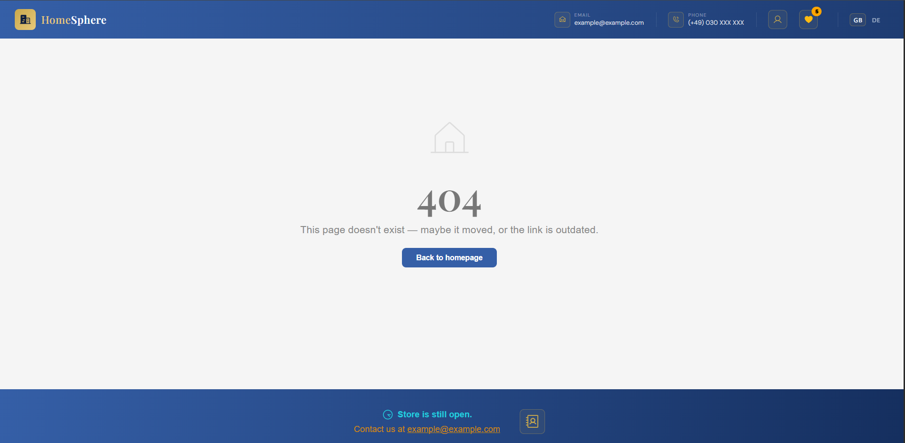

# HomeSphere – Real Estate App


🔗 [Live Demo](https://homesphere-web.vercel.app)

### Demo login (read-only admin)

Interested users who simply want to test the admin part of this app can explore the admin dashboard — but without modifying production data:

|              |                                                                                    |
| ------------ | ---------------------------------------------------------------------------------- |
| **URL**      | [https://homesphere-web.vercel.app/login](https://homesphere-web.vercel.app/login) |
| **Email**    | `demo@homesphere.app`                                                              |
| **Password** | `123456`                                                                           |

The demo account is **read-only**: listing and inquiry views work; create, edit, delete, and photo upload are blocked in the UI and enforced on the API (`blockDemoWrites`).

---

HomeSphere is a full-stack real estate platform for property seekers and administrators. Browse listings across Europe, filter by category and deal type, save favorites, and contact agents via email.An advanced search enables combined filtering across key property attributes for fast, precise results. A conversational AI Property Matching Agent (DeepSeek + LangGraph) lets users describe what they're looking for in plain language and get matching listings. Admins can manage the entire property catalog through a protected dashboard.

**Tech Stack:** React frontend with a Node.js/Express REST API, PostgreSQL on Supabase, DeepSeek (via LangGraph) for AI-powered search, Resend for emails, and react‑i18next for multilingual support (EN/DE).

Built with **security**, **performance**, and **user experience** in mind – featuring Supabase Authentication, JWT-based session management, lazy loading, and a fully responsive design.

## Screenshots

|                                                                                             |                                                                                    |
| ------------------------------------------------------------------------------------------- | ---------------------------------------------------------------------------------- |
| <br>_Home Page with Advanced Filter & AI Button_ | <br>_Main Listings_                     |
| <br>_Footer_                                 | <br>_Property Details_            |
| <br>_Contact Form_               | <br>_Favorites_          |
| <br>_Mortgage Calculator_            | <br>_Contact Page_      |
| <br>_Login_                               | <br>_Admin Dashboard_            |
| <br>_Add New Entry Modal_    | <br>_Add Entry Modal_ |
| <br>_Delete Entry_         | <br>_Not Found Page_                |

---

## Table of Contents

- [Features](#features)
- [Tech Stack](#tech-stack)
- [Project Structure](#project-structure)
- [API](#api)
- [Authentication](#authentication)
- [Deployment](#deployment)
- [Getting Started](#getting-started)
- [Testing](#testing)
- [Available Scripts](#available-scripts)
- [Roadmap](#roadmap)

---

## Features

### Property Management

- Property listings fetched from PostgreSQL database via REST API
- Filter by category (Apartment, Chalet, Residence, Studio, Townhouse)
- Filter by deal type (Rent / Buy)
- Advanced search (collapsible): rooms, area (m²), price, energy class, with reset
- Detail page with full property info, stats, and interactive map
- Mortgage calculator on property detail pages
- Photo upload directly in the admin dashboard, stored in Supabase Storage
- Pagination for property listings
- Confirmation modal before deleting a property
- Contact inquiries persisted in PostgreSQL and listed in the admin dashboard

### AI Property Matching Agent

- Conversational search: describe what you're looking for in plain language (EN/DE) and get matching listings
- `POST /api/agent/match` runs a LangGraph pipeline (`parse` → `search`): DeepSeek extracts structured search criteria from the message, then a parameterized SQL query searches `entries`
- Multi-turn follow-ups (e.g. "rent instead") merge with the previous turn's criteria server-side, so the model only needs to return what changed
- Clarifying questions (`needMoreInfo` / `followUpQuestion`) when a request is too vague to search
- Rate limited to 20 requests / 10 minutes per IP
- Cost-optimized: fixed, byte-identical system prompt kept as the first message so DeepSeek's automatic prompt caching applies, plus a trimmed client-side chat history (last 4 turns, greeting excluded)

### Authentication & Security

- **Supabase Authentication** with JWT-based session management
- **Protected admin routes** with token validation middleware
- **Server-side token verification** using Supabase Admin Client
- **Server-side request validation** with Zod schemas (entries, contact form, and `:id` route params) — invalid requests return 400 with field-level error details
- **Security headers** via Helmet
- Environment-based configuration for dev/prod
- Rate limiting on contact endpoint (3 requests per 10 minutes) and admin endpoints (100 requests per 15 minutes)
- **Demo role**: read-only admin for interested users (UI disabled + server-side write block)
- **JSON body size limit** (`express.json({ limit: "100kb" })`)
- **`GET /api/health`** – liveness probe including database check

### User Experience & User Interface (UX/UI)

- Responsive layout for mobile, tablet, and desktop
- Modern UI with Phosphor and Lucide icons for clean, professional visuals
- Smooth animations with Framer Motion for page transitions and interactions
- Loading and error states for all API calls
- Multi-language support (EN/DE) with react-i18next
- Admin UI also fully internationalized (EN/DE), including demo-mode banner and messages
- Favorites system with localStorage persistence
- Accessibility: keyboard-navigable property cards, ARIA labels on interactive controls, visible focus states
- Custom 404 page for unmatched routes
- Animated `ConfirmModal` (Framer Motion) before permanent entry deletion

### Performance

- Optimised images with lazy loading and WebP support
- Uploaded photos are automatically resized (max 1200px) and re-encoded as WebP (quality 80) via Sharp before storage
- One-off `optimize-photos.js` script to compress existing property photos in bulk
- Custom `useFetch` hook for efficient data fetching
- Memoized components to prevent unnecessary re-renders

### Developer Experience

- Modular component structure for easy maintenance
- Centralised API configuration
- Testing with Vitest + React Testing Library + Supertest
- Separate deployments (Vercel for frontend, Render for API)
- CI workflow (`.github/workflows/ci.yml`) runs lint + tests on every push/PR to `main` (GitHub Actions secrets for environment config where needed)

### SEO

- Dynamic document title and meta description on property detail pages
- Open Graph tags on detail pages (`og:title`, `og:description`, `og:image`, `og:url`, `og:type`) with absolute image URLs

## Tech Stack

|              | Tool                                 | Version  |
| ------------ | ------------------------------------ | -------- |
| **Frontend** | React                                | 19       |
|              | React Router DOM                     | 7        |
|              | Phosphor Icons                       | 1        |
|              | Lucide Icons                         | 1        |
|              | Yup                                  | 1        |
|              | Vite                                 | 8        |
|              | CSS Custom Properties                |          |
|              | react-i18next                        | 17       |
|              | i18next                              | 26       |
|              | Leaflet + react-leaflet              | 1 / 4    |
|              | Vitest + React Testing Library       | 4 / 16   |
|              | Framer Motion                        | 12       |
| **Backend**  | Node.js                              |          |
|              | Express                              | 4        |
|              | CORS                                 | 2        |
|              | pg (node-postgres)                   | 8        |
|              | dotenv                               | 17       |
|              | express-rate-limit                   | 7        |
|              | he(XSS sanitization)                 | 1        |
|              | multer (file uploads)                | 2        |
|              | sharp (image processing)             | 0.35     |
|              | zod (validation)                     | 4        |
|              | helmet (security headers)            | 8        |
|              | Resend                               | 6        |
|              | @supabase/supabase-js                | 2        |
|              | Vitest + Supertest                   | 4 / 7    |
| **AI**       | DeepSeek (via OpenAI-compatible API) | v4-flash |
|              | @langchain/core                      | 1        |
|              | @langchain/langgraph                 | 1        |
|              | @langchain/openai                    | 1        |
| **Database** | PostgreSQL via Supabase              |          |
| **Hosting**  | Vercel (Frontend)                    |          |
|              | Render (Backend API)                 |          |
|              | Supabase (Database + Auth)           |          |
| **Auth**     | Supabase Auth                        |          |
|              | JWT (JSON Web Tokens)                |          |
| **Email**    | Resend                               |          |
| **Testing**  | Vitest                               |          |
|              | React Testing Library                |          |
|              | Supertest                            |          |

---

## Architecture Overview

The application follows a clean three‑tier architecture:

```
┌─────────────────────────────────────────────────────────┐
│ FRONTEND (Vercel)                                       │
│ ┌─────────────────────────────────────────────────┐     │
│ │ Login → Supabase Auth → JWT-Token               │     │
│ │ Admin → Sends token in Authorization Header     │     │
│ └─────────────────────────────────────────────────┘     │
└─────────────────────────────────────────────────────────┘
│
▼
┌─────────────────────────────────────────────────────────┐
│ BACKEND (Render)                                        │
│ ┌─────────────────────────────────────────────────┐     │
│ │ authenticateSupabase Middleware                 │     │
│ │ Validates token with Supabase Admin Client      │     │
│ │ Protects POST/PUT/DELETE /api/entries           │     │
│ │ Protects POST /api/upload                       │     │
│ └─────────────────────────────────────────────────┘     │
└─────────────────────────────────────────────────────────┘
│                                       │
▼                                       ▼
┌───────────────────────────┐   ┌───────────────────────────┐
│ DATABASE (Supabase)       │   │ STORAGE (Supabase)        │
│ ┌───────────────────────┐ │   │ ┌───────────────────────┐ │
│ │ PostgreSQL, entries   │ │   │ │ property-photos bucket│ │
│ │ table, via pg driver  │ │   │ │ (public read access)  │ │
│ └───────────────────────┘ │   │ └───────────────────────┘ │
└───────────────────────────┘   └───────────────────────────┘
```

---

## Project Structure

```
homesphere/
├── client/                                 # React Frontend
│   ├── public/
│   │   ├── favicons/
│   │   ├── photos/                         # Property images
│   │   └── screenshots/                    # README screenshots
│   ├── src/
│   │    ├── App.jsx
│   │    ├── App.css
│   │    ├── main.jsx
│   │    ├── index.html
│   │    ├── config/
│   │    │   ├── supabase.js                # Supabase configuration
│   │    │   └── api.js                     # Central API URL config (dev/prod)
│   │    ├── context/
│   │    │   ├── AuthContext.js             # Context object for auth state
│   │    │   ├── AuthProvider.jsx           # Provides auth state to entire app
│   │    │   ├── useAuth.js                 # Custom hook for consuming auth context
│   │    │   └── FavoritesContext.jsx       # Global favorites state with localStorage
│   │    ├── i18n/                          # i18next configuration
│   │    │   └── locales/
│   │    │        ├── en/translation.json
│   │    │        └── de/translation.json
│   │    ├── hooks/
│   │    │   └── useFetch.js                # Custom fetch hook
│   │    ├── __tests__/
│   │    │   ├── setup.js                   # Test environment setup
│   │    │   ├── useFetch.test.js           # Tests for useFetch hook
│   │    │   └── FavoritesContext.test.jsx  # Tests for FavoritesContext
│   │    ├── components/
│   │    │   ├── Navbar/
│   │    │   ├── Heading/
│   │    │   ├── Footer/
│   │    │   ├── LoadingSpinner/            # Spinner for loading time
│   │    │   ├── MapModal/                  # Leaflet map modal with Nominatim
│   │    │   ├── ContactForm/               # Multi-step modal with Yup validation
│   │    │   ├── MortgageCalculator/        # Monthly payment calculator with useMemo
│   │    │   ├── ProtectedRoute/            # Protect routes from unauthorized access
│   │    │   ├── ConfirmModal/              # Reusable confirm dialog (e.g. delete confirmation)
│   │    │   ├── AIAgent/                   # Conversational property-matching chat widget
│   │    │   │    ├── AIAgentChat.jsx       # Chat UI, calls POST /api/agent/match
│   │    │   │    └── AIAgentChat.css
│   │    │   └── Main/
│   │    │       ├── RealEstate.jsx         # Filter logic + listings
│   │    │       └── RealEstateCard/
│   │    │           ├── RealEstateDetails/
│   │    │           └── RealEstatePhoto/
│   │    │               ├── RealEstateCategory/
│   │    │               ├── RealEstateStatus/
│   │    │               └── IconItem/
│   │    └── pages/
│   │        ├── EstateDetails/             # Detail page with map, mortgage calculator
│   │        ├── Contact/                   # Company contact info page
│   │        ├── Login/                     # Login page for user authentication
│   │        ├── Admin/                     # Admin dashboard providing CRUD operations
│   │        ├── Favorites/                 # Saved properties page
│   │        └── NotFound/                  # 404 page (catch-all route)
│   └── package.json
└── server/                                 # Node.js / Express Backend
    ├── db.js                               # PostgreSQL connection pool
    ├── server.js                           # Express server & routes
    ├── server.start.js                     # Entry point – starts the Express server
    ├── server.test.js                      # Backend integration tests (Supertest)
    ├── vitest.config.js                    # Vitest config for server
    ├── validation.js                       # Zod schemas (entries, contact, :id params)
    ├── middleware/
    │   └── validate.js                     # Express middleware applying Zod schemas
    ├── scripts/
    │   └── optimize-photos.js              # Bulk-compress existing property photos
    ├── src/
    │   └── agent/                          # AI Property Matching Agent (LangGraph pipeline)
    │       ├── router.ts                   # POST /api/agent/match, rate limiters, request validation
    │       ├── graph.ts                    # LangGraph pipeline: parse -> search
    │       ├── parseIntent.ts              # DeepSeek call: message -> structured SearchCriteria
    │       ├── mergeCriteria.ts            # Merges new criteria with previous turn's criteria
    │       ├── searchProperties.ts         # Parameterized SQL search against `entries`
    │       ├── criteriaSchema.ts           # Zod schema for extracted search criteria
    │       └── llm.ts                      # DeepSeek chat model config (OpenAI-compatible)
    ├── migrations/                         # One-off SQL changes applied to the live DB, in order
    │   └── 0001_enable_rls_entries.sql     # Enables RLS on `entries`, adds public read-only policy
    ├── schema.sql                          # Database table definition
    ├── seed.sql                            # Initial data (entries)
    ├── .env
    └── package.json
```

---

## API

The backend is a custom Node.js/Express REST API connected to a PostgreSQL database on Supabase, deployed on [Render.com](https://render.com):

### Public Endpoints:

```
GET  https://homesphere-kifc.onrender.com/api/entries
GET  https://homesphere-kifc.onrender.com/api/entries/:id
POST https://homesphere-kifc.onrender.com/api/contact
POST https://homesphere-kifc.onrender.com/api/agent/match
```

### Protected Endpoints (require valid Supabase JWT):

```
POST   https://homesphere-kifc.onrender.com/api/entries
PUT    https://homesphere-kifc.onrender.com/api/entries/:id
DELETE https://homesphere-kifc.onrender.com/api/entries/:id
POST   https://homesphere-kifc.onrender.com/api/upload
```

`POST /api/upload` accepts a single image file (`multipart/form-data`, field
name `photo`, max 5 MB) via Multer, resizes it (max 1200px) and re-encodes it
as WebP (quality 80) via Sharp, forwards it to a Supabase Storage bucket,
and returns its public URL for use as a property's `photo` field.

### Request Validation

`POST`/`PUT /api/entries` and `POST /api/contact` validate the request body
against [Zod](https://zod.dev) schemas (`server/validation.js`); `:id` route
params are validated as positive integers. Invalid requests return `400`
with field-level error details instead of reaching the database.

---

## Authentication

The application uses **Supabase Authentication** with JWT-based session management:

1. **Login**: User credentials are authenticated via Supabase Auth
2. **JWT Generation**: Supabase issues a JWT token on successful login
3. **Token Storage**: Token is stored in the AuthContext and sent with each request
4. **Token Validation**: Backend validates the token using Supabase Admin Client
5. **Protected Routes**: Admin routes require a valid token in the Authorization header
6. **Session Management**: Token is automatically refreshed by Supabase

---

## Deployment

### Frontend (Vercel)

- Automatic deployments on push to main branch
- Environment variables: `VITE_SUPABASE_URL`, `VITE_SUPABASE_ANON_KEY`

### Backend (Render)

- Manual or automatic deployments from GitHub
- Environment variables: `DATABASE_URL`, `RESEND_API_KEY`, `CONTACT_EMAIL`, `SUPABASE_URL`, `SUPABASE_SECRET_KEY`, `SUPABASE_STORAGE_BUCKET`, `AI_API_KEY`, `AI_MODEL` (optional, see [Configure environment variables](#3-configure-environment-variables))
- Rate limiting: 3 requests/10min for contact endpoint; AI agent endpoint limited to 5 requests/10min (burst) and 10 requests/24h (daily) per IP
- Admin endpoint protected with Supabase Auth middleware

### Continuous Integration

A GitHub Actions workflow (`.github/workflows/ci.yml`) runs on every push and
pull request to `main`: it installs dependencies, lints the client, and runs
the client and server test suites. This is separate from the keep-alive
workflow below.

### Keep-Alive / Cold-Start Prevention

The backend runs on Render's free tier, which spins the server down after ~15 minutes
of inactivity. The first request afterward triggers a "cold start" that can take up
to 30 seconds.

To prevent this, the service is kept warm via regular pings:

- **Primary:** [cron-job.org](https://cron-job.org) pings
  `GET https://homesphere-kifc.onrender.com/api/entries` every 10 minutes
- **Backup:** a GitHub Actions workflow (`.github/workflows/keep-alive.yml`) pings
  the same endpoint every 10 minutes as well (note: GitHub does not guarantee exact
  timing for scheduled workflows, so this only serves as redundancy)

---

## Getting Started

### 1. Clone the repo

```bash
git clone https://github.com/wkleus/homesphere.git
cd homesphere
```

### 2. Set up the database

Create a PostgreSQL database (e.g. on [Supabase](https://supabase.com)) and run the following SQL files in order:

```
server/schema.sql   ← creates the entries table
server/seed.sql     ← inserts all entries
```

For a new database, the `server/schema.sql` file is sufficient — it always reflects the current schema. For an existing database (e.g., a live Supabase project), the corresponding files from the `server/migrations/` directory must be executed in the order of their filenames instead, in order to apply only the specific changes (which are already included in `schema.sql`).

### 3. Configure environment variables

Create `.env` files for both backend and frontend. Use the following templates:

#### Create `server/.env`:

```
# Server port (Render sets this automatically in production)
PORT=3000

# PostgreSQL connection string (Supabase)
DATABASE_URL=your_postgresql_connection_string

# Resend API key for email sending
RESEND_API_KEY=your_resend_api_key

# Email address that receives contact form submissions
CONTACT_EMAIL=your@email.com

# Supabase configuration for Auth (get from Supabase Dashboard → Project Settings → API)
SUPABASE_URL=your_supabase_project_url
SUPABASE_SECRET_KEY=your_supabase_secret_key

# Supabase Storage bucket for property photo uploads.
# Create a PUBLIC bucket with this exact name in the Supabase Dashboard
# (Storage → New bucket) before using the admin photo upload feature
# Defaults to "property-photos" if not set.
SUPABASE_STORAGE_BUCKET=property-photos

# DeepSeek API key for the AI Property Matching Agent (POST /api/agent/match).
AI_API_KEY=your_deepseek_api_key

# DeepSeek model used for criteria extraction. Optional, defaults to
AI_MODEL=deepseek-v4-flash
```

#### Create `client/.env`:

```
# Supabase configuration (for authentication)
VITE_SUPABASE_URL=your_supabase_project_url
VITE_SUPABASE_ANON_KEY=your_supabase_anon_key
```

> **⚠️ Security Note:** Never commit `.env` files to Git. Both files are already excluded via `.gitignore`. Consider creating `.env.example` files to show required variables without exposing sensitive data.

### 4. Start the backend

```bash
cd server
npm install
npm run dev
```

API runs at `http://localhost:3000`

### 5. Start the frontend

```bash
cd client
npm install
npm run dev
```

App runs at `http://localhost:5000`

Or check out the 🔗 **[Live Demo](https://homesphere-web.vercel.app)**

---

## Testing

**Frontend** tests are written with **Vitest** and **React Testing Library**.

```bash
cd client
npm test            # watch mode
npm run test:run    # run once
```

| Test file                   | What it covers                                                          |
| --------------------------- | ----------------------------------------------------------------------- |
| `useFetch.test.js`          | loading state, successful fetch, undefined url guard                    |
| `FavoritesContext.test.jsx` | toggle add/remove, isFavorite, localStorage persistence, provider error |

**Backend** tests are written with **Vitest** and **Supertest**.

```bash
cd server
npm test          # watch mode
npm run test:run  # run once
```

| Test file        | What it covers                                                  |
| ---------------- | --------------------------------------------------------------- |
| `servre.test.js` | GET /api/entries → checks it returns 200 and camelCase data     |
|                  | GET /api/entries/:id → checks 404 for missing entry             |
|                  | POST /api/contact → checks 400 when required fields are missing |

---

## Available Scripts

### Client

| Command            | Description               |
| ------------------ | ------------------------- |
| `npm run dev`      | Start frontend dev server |
| `npm run build`    | Build for production      |
| `npm run preview`  | Preview production build  |
| `npm run lint`     | Run ESLint                |
| `npm test`         | Run tests in watch mode   |
| `npm run test:run` | Run tests once            |

### Server

| Command            | Description                |
| ------------------ | -------------------------- |
| `npm run dev`      | Start backend with nodemon |
| `npm start`        | Start backend (production) |
| `npm test`         | Run tests in watch mode    |
| `npm run test:run` | Run tests once             |

---

## Roadmap

### Completed

- [x] Frontend deployment on Vercel
- [x] Backend deployment on Render
- [x] PostgreSQL database on Supabase
- [x] REST API with property entries
- [x] Category & deal-type filters
- [x] Property detail page
- [x] Custom `useFetch` hook
- [x] Responsive layout
- [x] Multi-step contact form with Yup validation
- [x] Email delivery via Resend
- [x] Favorites system with Context API and localStorage
- [x] Multilingual support (EN/DE) with react-i18next
- [x] Mortgage calculator with annuity formula (useMemo)
- [x] Map integration with Leaflet and OpenStreetMap geocoding
- [x] Frontend unit tests for useFetch and FavoritesContext (Vitest + React Testing Library)
- [x] Backend integration tests for all API endpoints (Supertest)
- [x] Admin Login for authentication
- [x] Authentication with Supabase Auth
- [x] Admin dashboard for CRUD actions
- [x] SEO improvements: lazy loading + compressed Webp images
- [x] Security: Supabase Auth with server-side token validation
- [x] Protected admin routes with Supabase middlewar
- [x] Photo upload via Supabase Storage in the admin dashboard
- [x] Custom 404 page for unmatched routes
- [x] Pagination for property listings
- [x] Server-side request validation with Zod schemas
- [x] Security headers via Helmet
- [x] Accessibility improvements: keyboard navigation, ARIA labels, focus states
- [x] Custom delete-confirmation modal (replacing native `window.confirm()`)
- [x] CI workflow for automated linting and testing (`.github/workflows/ci.yml`)
- [x] Automatic photo resizing/compression on upload + bulk optimization script
- [x] Advanced search - Price, rooms, size, combined filters
- [x] Contact inquiries persisted in PostgreSQL and listed in the admin dashboard
- [x] Demo login (read-only admin)
- [x] AI Property Matching Agent (conversational search via DeepSeek + LangGraph)
- [x] Cost-optimized AI prompt (DeepSeek prompt caching + trimmed client-side chat

### Next Steps

- [ ] Improved AI Agent
- [ ] Further SEO / SSR improvements
- [ ] Expanded API test coverage
