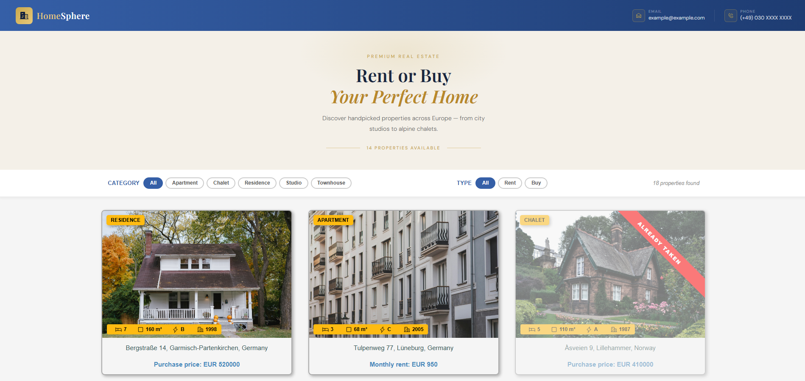
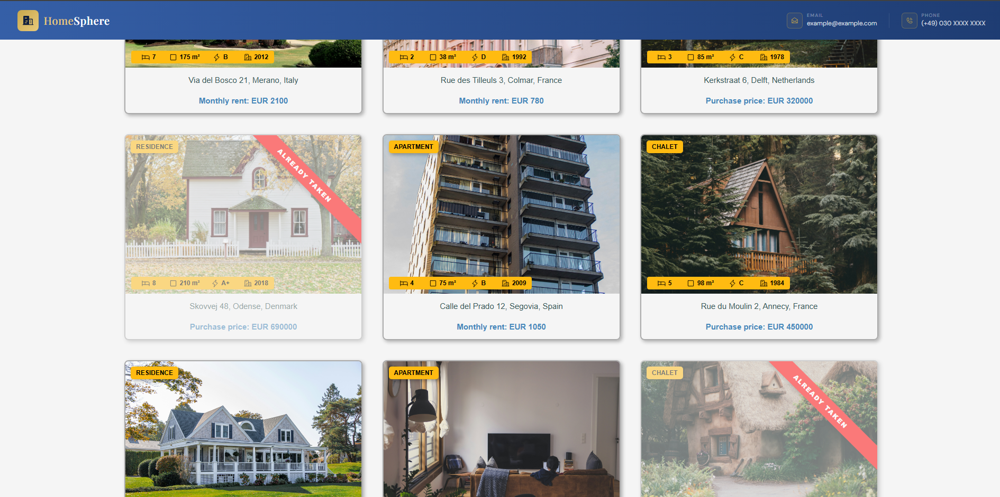
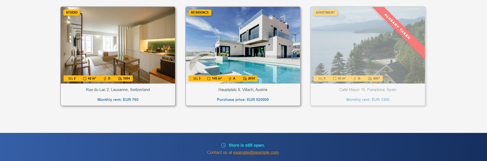
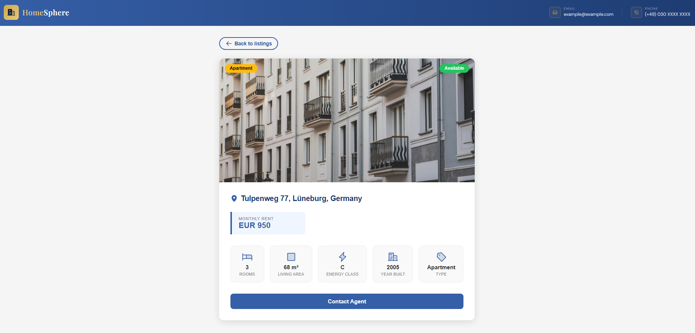

# HomeSphere – Real Estate Frontend


🔗 [Live Demo](https://homesphere-web.vercel.app)

A modular React frontend for browsing and discovering residential properties across Europe — from city apartments to alpine chalets.

---

## Screenshots

<div style="display:flex; gap:20px; flex-wrap:wrap;">
  <div style="width:calc(50% - 6px); text-align:center;">
    
    <p><em>Home – Navbar with contact info and hero heading</em></p>
  </div>
  <div style="width:calc(50% - 6px); text-align:center;">
    
    <p><em>Main – Property listings with category and deal type filters</em></p>
  </div>
  <div style="width:calc(50% - 6px); text-align:center;">
    
    <p><em>Footer – Opening hours and contact details</em></p>
  </div>
  <div style="width:calc(50% - 6px); text-align:center;">
    
    <p><em>Detail Page – Full property info with stats and pricing</em></p>
  </div>
</div>

## Features

- **18 property listings** with photos, details and pricing
- **Filter by category** (Apartment, Chalet, Residence, Studio, Townhouse)
- **Filter by deal type** (Rent / Buy)
- **Detail page** per property with full info and stats
- **Client-side routing** via React Router
- **Responsive layout** for mobile and desktop

---

## Tech Stack

| Tool                    | Version |
| ----------------------- | ------- |
| React                   | 19      |
| React Router DOM        | 7       |
| Phosphor Icons          | 1.4     |
| Vite                    | 8       |
| JavaScript (ESM)        | —       |
| CSS (custom properties) | —       |

---

## Project Structure

```
homesphere/
├── public/
│   ├── favicons/            # Favicons
│   ├── photos/              # Property images
│   └── screenshots/         # Screenshots for README.md
└── src/
    ├── App.jsx
    ├── App.css
    ├── main.jsx
    ├── content/
    │   └── entries.js       # Property data
    ├── components/
    │   ├── Navbar/
    │   ├── Heading/
    │   ├── Footer/
    │   └── Main/
    │       ├── RealEstate.jsx        # Filter logic + listing
    │       └── RealEstateCard/
    │           ├── RealEstateCard.jsx
    │           ├── RealEstateDetails/
    │           └── RealEstatePhoto/
    │               ├── RealEstateCategory/
    │               ├── RealEstateStatus/
    │               └── IconItem/
    └── pages/
        └── EstateDetails/   # Property detail page
```

---

## Getting Started

```bash
git clone https://github.com/wkleus/homesphere.git
cd homesphere
npm install
npm run dev
```

Open [http://localhost:5000](http://localhost:5000) in your browser.

Or check our the 🔗 ** [Live Demo](https://homesphere-web.vercel.app)**

---

## Available Scripts

| Command           | Description              |
| ----------------- | ------------------------ |
| `npm run dev`     | Start development server |
| `npm run build`   | Build for production     |
| `npm run preview` | Preview production build |
| `npm run lint`    | Run ESLint               |

---
